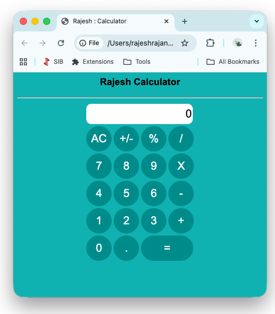

# 🧮 JavaScript Calculator

A clean, fully functional calculator built with vanilla HTML, CSS, and JavaScript — inspired by the iOS calculator design.



## ✨ Features

- **Basic arithmetic** — Addition, Subtraction, Multiplication, Division
- **Percentage calculation** — Convert any value to percentage instantly
- **Positive / Negative toggle** — Flip the sign with +/- button
- **Decimal support** — Single decimal point enforcement
- **All Clear (AC)** — Reset to zero in one tap
- **Clean iOS-inspired UI** — Circular buttons, teal colour scheme, smooth hover effects
- **Zero external dependencies** — Pure HTML, CSS, and JavaScript

## 🖥️ Demo

Open `index.html` directly in any browser — no build tools, no installation required.

## 🚀 How to Run

### Option 1 — Open directly
```bash
# Clone the repository
git clone https://github.com/rajesh-rajan-dev/javascript-calculator.git

# Open in browser
open index.html
```

### Option 2 — GitHub Pages
This project is hosted live via GitHub Pages:
👉 **[Live Demo](https://rajesh-rajan-dev.github.io/javascript-calculator/)**

## 🛠️ Built With

| Technology | Purpose |
|---|---|
| HTML5 | Structure and layout |
| CSS3 | Styling, hover effects, responsive design |
| JavaScript (ES5) | Calculator logic, DOM manipulation |

## 📐 Project Structure

```
javascript-calculator/
│
├── index.html        # Main application file (HTML + CSS + JS)
├── screenshot.png    # UI screenshot
└── README.md         # Project documentation
```

## 🔧 Key JavaScript Concepts Used

- **DOM Manipulation** — `getElementById`, `value` property
- **Event Handling** — `onclick` button events
- **State Management** — Tracking operands, operators, and decimal state
- **Type Coercion** — `parseFloat()` for accurate arithmetic
- **Conditional Logic** — Operator-based calculation routing

## 💡 How It Works

The calculator maintains three state variables:
- `operand1` — First number entered
- `operand2` — Second number entered  
- `operator` — The selected operation (+, -, ×, ÷)

When an operator button is pressed, `operand1` is stored and the display resets for the next input. When `=` is pressed, the operation is executed and the result is displayed.

## 🎨 Design Highlights

- Teal (`#008b8b`) colour palette with white text
- Circular buttons (`border-radius: 50px`) matching iOS calculator style
- White hover effect for visual feedback
- Centered layout using CSS `margin: auto`

## 👨‍💻 Author

**Rajesh Rajan**  
Senior Java Backend Engineer | Stockholm, Sweden  
[LinkedIn](https://www.linkedin.com/in/rajesh-rajan-358247100/) · [GitHub](https://github.com/YOUR_USERNAME)

---

*This project demonstrates front-end development fundamentals — part of a broader portfolio showcasing Java backend, cloud architecture, and full-stack capabilities.*
